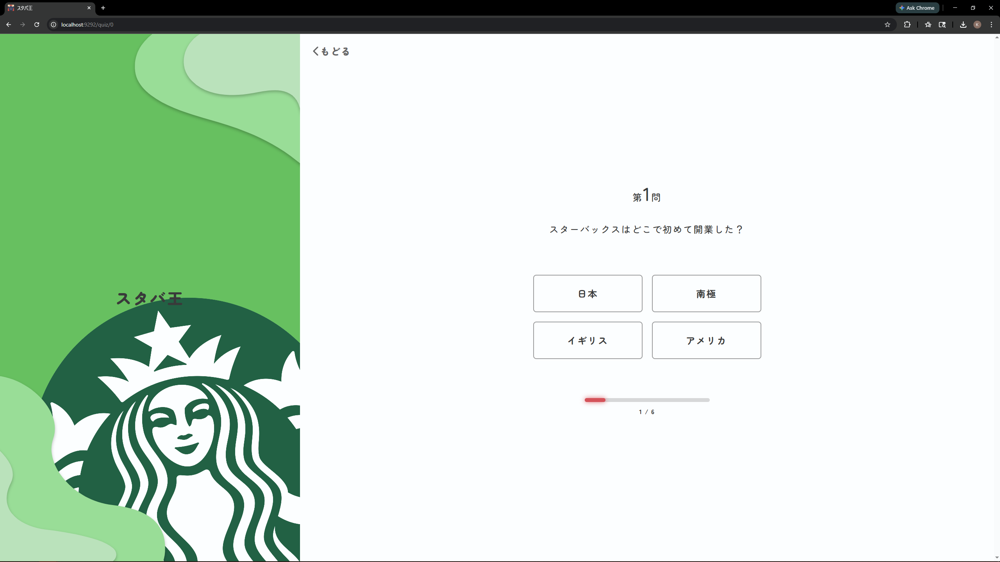
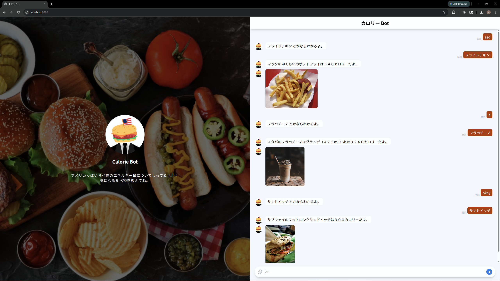
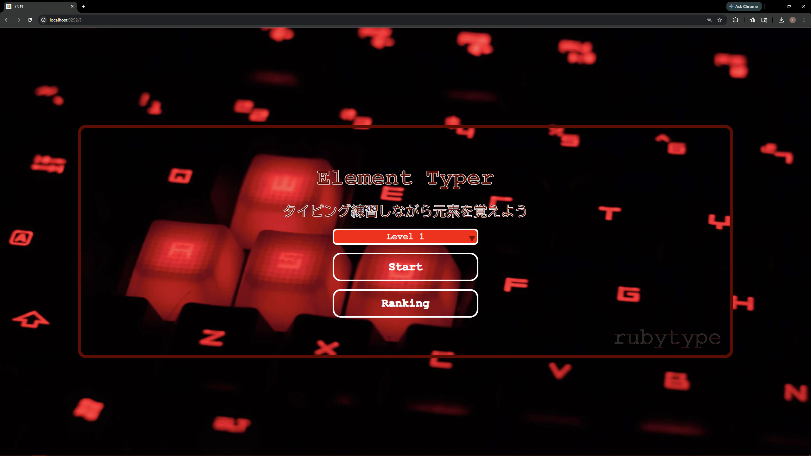
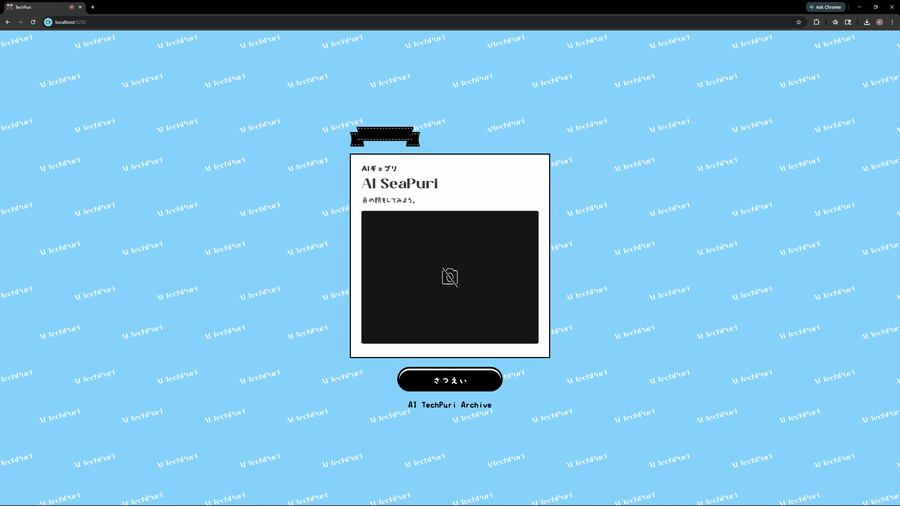

# ruby-sinatra-demos

Ruby/Sinatra web apps. Each subfolder is a separate application.

## Prerequisites

- **Ruby** 3.0 or newer
- **Bundler:** `gem install bundler`
- **techda only:** PostgreSQL (see Database setup below)

**Troubleshooting:**

- If **bcrypt** fails with “can't find header files”, install the Ruby development package for your OS (e.g. `ruby-dev`, `ruby-devel`, or Xcode Command Line Tools on macOS).
- If **bundle install** fails with permission errors writing to the system gem directory, each app is configured to use `vendor/bundle`; run `bundle install` again from the app directory.

---

## Projects


| App             | Description      | Database   |
| --------------- | ---------------- | ---------- |
| **bilson_king** | Quiz app (スタバ王)  | None       |
| **chatbot**     | Line bot webhook | None       |
| **techda**      | Game + rankings  | PostgreSQL |
| **techpri**     | Photo/face app   | None       |


Each app listens on port **9292** by default ([http://localhost:9292](http://localhost:9292)). Only one app should use that port at a time. To run another on a different port:

```bash
bundle exec rackup -o 0.0.0.0 -p 4567
```

Then open [http://localhost:4567](http://localhost:4567)

---

## 1. Install gems

From each app directory, install dependencies:

```bash
cd <app_folder>
bundle install
```

Gems are installed into `vendor/bundle` inside the app (no admin rights required).

---

## 2. Database setup (techda only)

techda uses PostgreSQL with database name `c_techda`.

1. **Install and start PostgreSQL** using your OS package manager or installer.
2. **Create the database and user.**
  On Linux/macOS, if your system user can connect via peer authentication:
   Or as the postgres superuser:
   On Windows, create database `c_techda` and a user (e.g. via pgAdmin or `psql`), and set `username` and `password` in `techda/config/database.yml` if required.
3. **Run migrations:**
  ```bash
   cd techda
   bundle exec rake db:migrate
  ```

---

## 3. Running each program

From the **project root**, run **one** of the following. Each app listens on **port 9292** by default.

### bilson_king

```bash
cd bilson_king
bundle install
bundle exec rackup -o 0.0.0.0
```

### chatbot

Uses `.env` for Line bot credentials (`LINE_CHANNEL_ID`, `LINE_CHANNEL_SECRET`, `LINE_CHANNEL_TOKEN`). Create or edit `.env` as needed.  
The Line bot logic (e.g. food/calorie replies) lives in `app.rb` and runs in the same process. By default the web UI forwards messages to the bot at `http://localhost:9292/callback`, and the bot’s replies are stored and shown in the UI. To use a different port, set `LINE_BOT_BASE_URL` (e.g. `http://localhost:9292`) and optionally `LINE_CALLBACK_URL`.

```bash
cd chatbot
bundle install
bundle exec rackup -o 0.0.0.0
```

### techda

Requires PostgreSQL and migrations (see Database setup above).

```bash
cd techda
bundle install
bundle exec rake db:migrate   # first time or after new migrations
bundle exec rackup -o 0.0.0.0
```

### techpri

```bash
cd techpri
bundle install
bundle exec rackup -o 0.0.0.0
```

---

## 4. Connecting

- **On the same machine:** open **[http://localhost:9292](http://localhost:9292)** (or the port you chose with `-p`).
- **From another machine:** use **http://your-machine-ip:9292**. The `-o 0.0.0.0` option makes the server listen on all interfaces so it can be reached from the network.

Stop the server with **Ctrl+C** in the terminal where `rackup` is running.

---

## Screenshots

**bilson_king** — Quiz app (スタバ王): answer questions about Starbucks and see your score and ranking.



**chatbot** — Line-style chat UI with a bot that replies (e.g. food and calorie info); can use a real Line channel or run locally.



**techda** — Typing game with level-based play and a PostgreSQL-backed rankings board.



**techpri** — Photo app with face detection and search (e.g. by expression).

